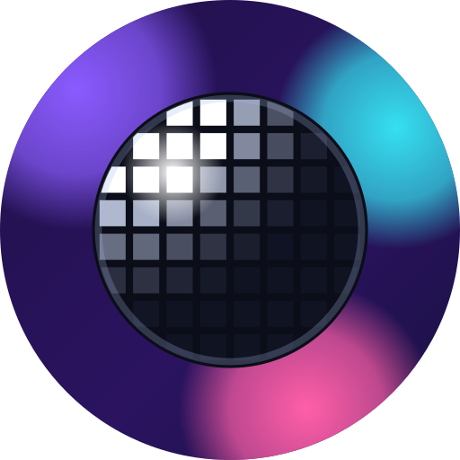
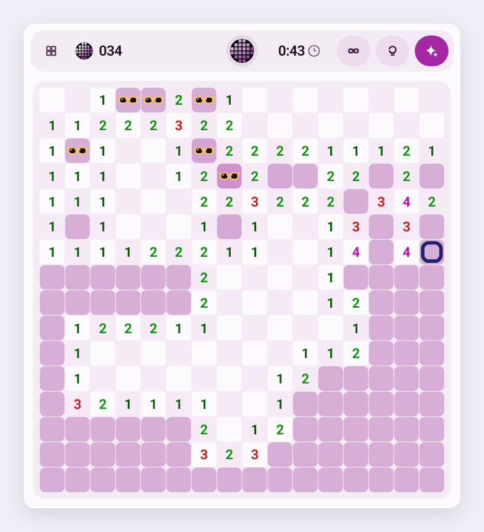
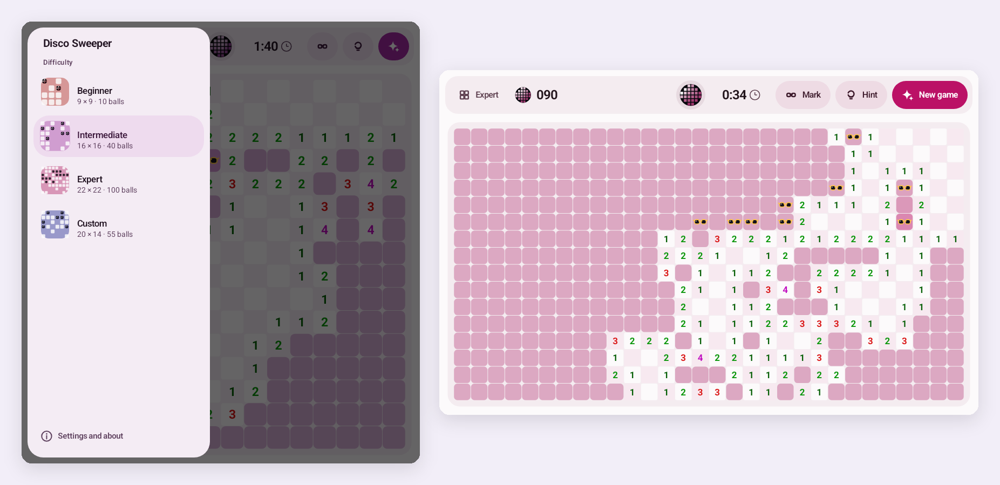
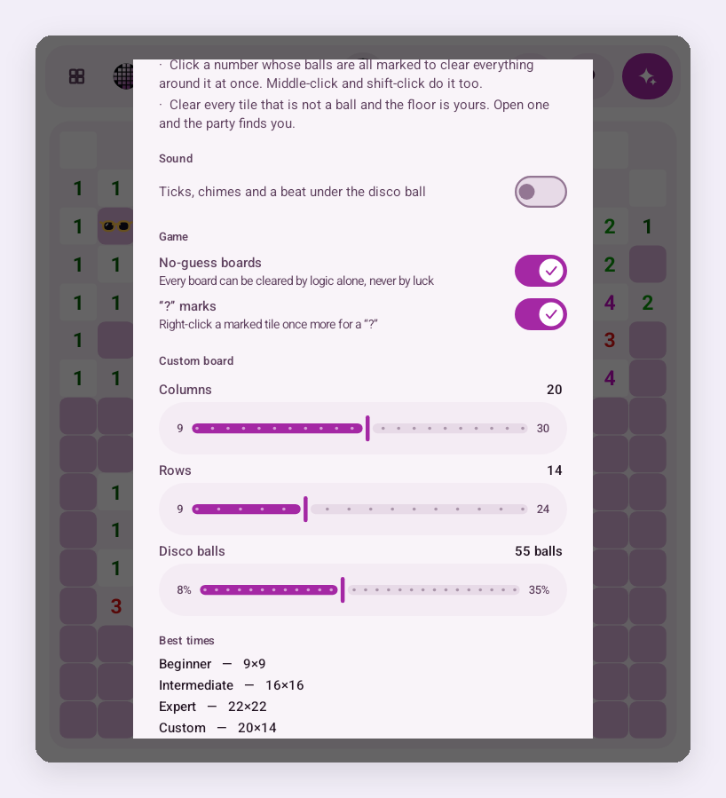

<p align="center">
  
</p>

<h1 align="center">Disco Sweeper</h1>

<p align="center">
  <b>Minesweeper's rules, exactly, with the mines swapped for disco balls.</b><br>
  Made for Android laptops and desktop windows: the board follows your window, and every tile is drawn for a mouse and a big screen.
</p>

<p align="center">
  <a href="../../releases/latest/download/DiscoSweeper.apk"><b>⬇ Download DiscoSweeper.apk</b></a>
  &nbsp;·&nbsp; <a href="#install">Install</a>
  &nbsp;·&nbsp; <a href="#how-to-play">How to play</a>
  &nbsp;·&nbsp; <a href="CHANGELOG.md">What's new</a>
</p>

<p align="center">
  
  
  
  
  
</p>

<p align="center"><sub>A private, personal passion project, made and owned by <a href="https://github.com/kuscher">Alexander Kuscher</a>.
Not affiliated with or endorsed by any employer (<a href="#about-this-project">more</a>).</sub></p>

<p align="center">
  
</p>

## What it is

Classic Minesweeper, the way you remember it, dressed for a party: tiles you clear, numbers that
count the disco balls around them, and sunglasses for the tiles you're sure about. Open a ball and
the party finds you.

- **The board follows the window.** Make the window bigger and you get more rows and columns, not
  a small board in a sea of empty space. Pick a difficulty and the window resizes itself to the
  classic 9×9, 16×16 or 30×16.
- **No-guess boards,** if you want them: every board can then be cleared by logic alone.
- **A hint that never lies.** It only uses what the numbers prove, and never trusts your own marks,
  so it can even show you a mark that's wrong.
- **Beginner, Intermediate, Expert and Custom** (9 to 30 columns, 9 to 24 rows, 8% to 35% balls),
  with a best time for every board size.
- **Made for a mouse and keyboard:** right-click to mark, middle-click or left+right to clear
  around a number. Touch works too: press and hold to mark.
- Light and dark, with a colour for each difficulty. Optional sound: ticks, chimes and a beat
  under the disco ball.

<p align="center">
  
  <br><sub>Each difficulty shows the board it would give you in the window as it is now.</sub>
</p>

## How to play

| | Mouse | Touch |
|---|---|---|
| **Clear a tile** | click | tap |
| **Mark a ball** (put its sunglasses on) | right-click | press and hold, or turn on **Mark** |
| **Clear around a number** whose balls are all marked | click it, middle-click, left+right, or shift-click | tap it |
| **Hint** | **Hint** flashes a safe tile (or a ball to mark) | |
| **New game** | the disco ball at the top, or **New game** | |

Clear every tile that isn't a ball to win. Your first click is always safe.

<p align="center">
  
  <br><sub>Settings and about: sound, no-guess boards, “?” marks, Custom's size and your best times.</sub>
</p>

## Install

Disco Sweeper runs on Android 12 or later, on Intel and Arm alike (one APK for both). It's
designed for a laptop or tablet with desktop windows, and works full screen too.

1. On your device, download
   **[DiscoSweeper.apk](../../releases/latest/download/DiscoSweeper.apk)** from the latest release.
2. Open it from your browser's downloads or your files app. If Android asks, allow that app to
   install apps, then tap **Install**.
3. Open **Disco Sweeper** from your apps.

To update, install a newer `DiscoSweeper.apk` over the old one; your best times and settings stay.

## Privacy

Disco Sweeper asks for **no permissions at all**: no internet, no storage, nothing. Your settings
and best times stay on your device, and they aren't included in backups.

## Build

Needs JDK 21 and the Android SDK (platform 37). No other dependencies: the app is plain Java on
the Android framework, with every screen drawn in code.

```sh
./gradlew :app:assembleDebug      # app/build/outputs/apk/debug/app-debug.apk
./gradlew :app:assembleRelease    # signed if ~/.config/discosweeper/keystore.jks and keystore.pass exist
./ds sim                          # the board-fit, solver and save/restore checks: no device needed
```

`./ds` is the development helper (build, install, launch, test hooks) for a device connected over
Wireless debugging, and `tools/smoke.sh` plays a whole game through the debug build's test
hooks; CI runs it in an x86_64 emulator. [CLAUDE.md](CLAUDE.md) explains how the code is organised,
and [docs/WINDOWING.md](docs/WINDOWING.md) how the board follows the window.

Releases are built and signed by GitHub Actions when a version tag is pushed:
[docs/RELEASING.md](docs/RELEASING.md).

## About this project

Disco Sweeper is my private, personal passion project. I made it, I own it, and I publish it here
myself, [Alexander Kuscher](https://github.com/kuscher). It has no affiliation with my employer: my
employer didn't make, sponsor, review or endorse it, and Disco Sweeper doesn't endorse my employer
or its products either. The views, choices and any mistakes here are mine alone.

— Alexander ([@kuscher](https://github.com/kuscher))

<sub>With a little help from Claude.</sub>

## License

Disco Sweeper is free software under the [MIT License](LICENSE). It has no third-party code.

Minesweeper is a classic game; Disco Sweeper is an independent take on it and isn't affiliated with
Microsoft.
